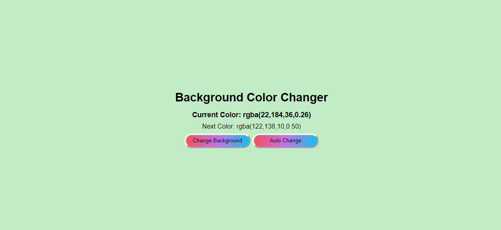

# Change Color Wih Future Prediction

 

## 🎓 &nbsp;Description

- An application which helps me to suggest the attractive UI colors that i can use in my project .
- Solves the problem related to choose rgba colors for UI developement for the attractive websites .

- It generates the random RGBA colours for the background and predicts the next colour for Background.

-  It has two buttons : - 
Auto generate colour and generate colour on button click.

## 💻 &nbsp;Install and Run Project

It is very simple to use because there are only three files (i.e. ".html", ".css" and ".js").  You can access the files from github to your own system repository and then can run it on Chrome Browser (with LiveServer or other method) .  

## 🤔 &nbsp; Working 

It is the main page where you interact with application and it is very simple to use.

There are two buttons only : - 

-  #### Change Background  
    -  It simply changes the background color to new random color and suggests the new background color to be .

- #### Auto Change
  - It automatically changes the background color in each 2 seconds until the same "stop" button is clicked .

## 🔧 &nbsp;Technologies and Skills used - 

- Hyper Text Markup Language ( HTML )
- Cascading Style Sheets  ( CSS )
- JavaScript

## 💼 &nbsp;Credits
The complete BMS is developed by Sourav Kumar (Shaurya) .
<h3> 🤝🏻 Connect with Sourav Kumar via -  </h3>

&nbsp;   
&nbsp;   
&nbsp; 
&nbsp; 

  
⭐️ From [ShauryaSingh-Official](https://github.com/ShauryaSingh-Official)

   
